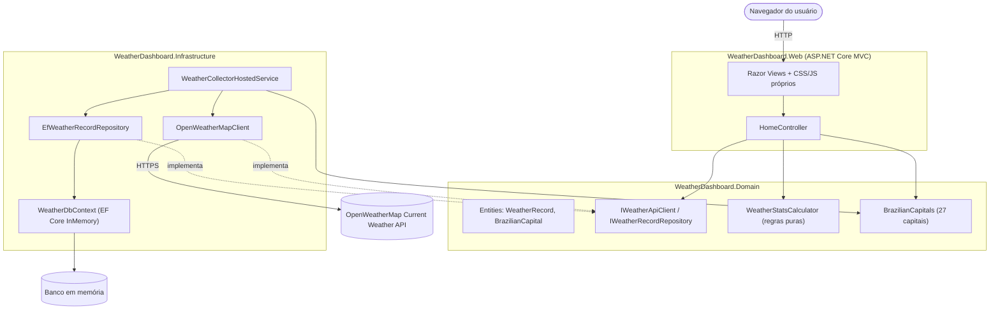
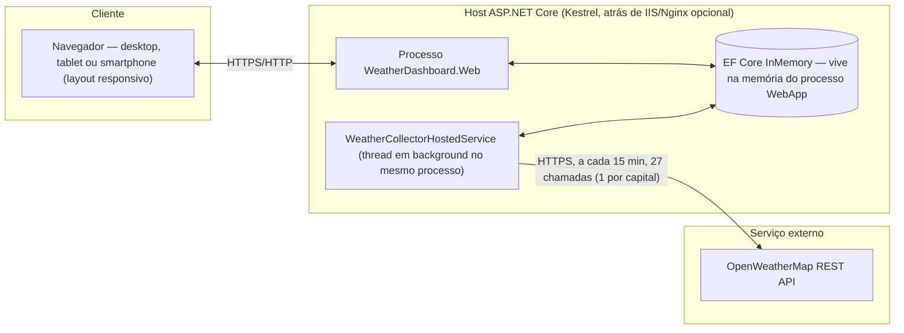
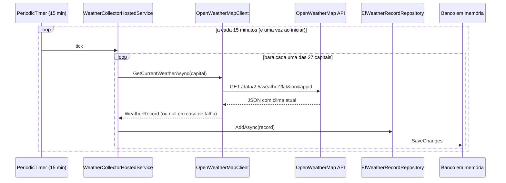

# Arquitetura

## Visão geral

O sistema é uma aplicação **ASP.NET Core MVC** organizada em três projetos (Clean
Architecture simplificada), mais um projeto de testes:

| Projeto | Responsabilidade | Depende de |
|---|---|---|
| `WeatherDashboard.Domain` | Entidades, interfaces (contratos), regras de negócio puras (cálculo de estatísticas), catálogo de capitais | nada (sem dependências externas) |
| `WeatherDashboard.Infrastructure` | EF Core (InMemory), cliente HTTP da OpenWeatherMap, serviço em background que coleta dados a cada 15 min | `Domain` |
| `WeatherDashboard.Web` | Controllers MVC, Views Razor, wwwroot (CSS/JS próprios, sem frameworks de UI prontos) | `Infrastructure`, `Domain` |
| `WeatherDashboard.Tests` | Testes unitários (xUnit + Moq) | todos os anteriores |

A dependência sempre aponta para dentro: `Web` → `Infrastructure` → `Domain`. O
`Domain` não conhece EF Core, HTTP ou ASP.NET — expõe apenas interfaces
(`IWeatherRecordRepository`, `IWeatherApiClient`) que a Infrastructure implementa.
Isso deixa a regra de negócio (`WeatherStatsCalculator`) trivialmente testável
sem banco de dados ou rede, e permite trocar o provedor de dados (ex.: banco
relacional em vez de InMemory) sem tocar em Domain ou Web.

## Diagrama lógico (componentes)

## Diagrama físico (implantação)

**Observação sobre o banco em memória:** como recomendado no enunciado, o
provedor padrão é `EF Core InMemory` — os dados vivem no processo do servidor e
são perdidos a cada reinício, o que é adequado para desenvolvimento/avaliação.
Como o acesso ao banco passa por `IWeatherRecordRepository`, trocar para um
provedor persistente (SQLite/SQL Server) em produção é uma mudança de uma
linha em [`InfrastructureServiceCollectionExtensions`](../src/WeatherDashboard.Infrastructure/InfrastructureServiceCollectionExtensions.cs) — nenhum outro
código muda.

## Fluxo de coleta periódica

Falhas de rede, chave inválida ou rate limit em uma capital são logadas e
**não** interrompem o ciclo — as demais capitais continuam sendo coletadas.

## Fluxo de leitura do dashboard

1. `GET /` (`HomeController.Index`) renderiza a página com o seletor de
   capitais e os filtros de data (padrão: últimos 7 dias).
2. O JavaScript (`wwwroot/js/dashboard.js`) faz `fetch` em
   `GET /Home/Data?city=...&start=...&end=...`.
3. `HomeController.Data` busca os registros do período no repositório e usa
   `WeatherStatsCalculator` (Domain) para agregar por dia — sem lógica de
   agregação no controller ou no banco.
4. A resposta JSON alimenta dois gráficos (Chart.js) e os cartões de
   estatística do dia atual.
5. O front-end reconsulta automaticamente a cada 5 minutos, então uma nova
   coleta do background service aparece no dashboard sem precisar recarregar
   a página.

## Principais decisões e suposições

- **MVC, não Razor Pages/Blazor**: solicitado explicitamente.
- **Coleta para todas as 27 capitais a cada ciclo**, não apenas a
  selecionada: o requisito pede atualização a cada 15 min e permitir trocar de
  cidade livremente: pré-coletar todas evita telas vazias ao trocar o filtro e
  fica dentro do limite gratuito da OpenWeatherMap (60 chamadas/min).
- **Agregação diária nos gráficos**: o período pode cobrir vários dias; cada
  ponto do gráfico é a agregação (mín/média/máx) das leituras daquele dia. As
  estatísticas "do dia atual" nos cartões usam sempre a data corrente,
  independentemente do filtro escolhido, como pedido no enunciado.
  ("temperatura máxima, mínima e média no período" +
  "lista de dados estatísticos do dia atual").
- **CSS e HTML escritos à mão** (sem Bootstrap/Tailwind ou templates
  prontos), conforme recomendado. É usada apenas a fonte Inter (Google Fonts)
  e os ícones Phosphor (fonte de ícones), além do Chart.js para os gráficos —
  bibliotecas pontuais, não um template de página pronto.
- **Falha silenciosa e resiliente na coleta**: sem chave de API configurada,
  a aplicação sobe normalmente e mostra um estado vazio no dashboard, em vez
  de falhar — importante para rodar o projeto localmente antes de configurar
  a chave.
