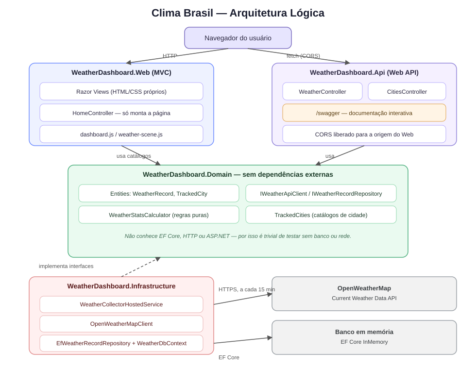
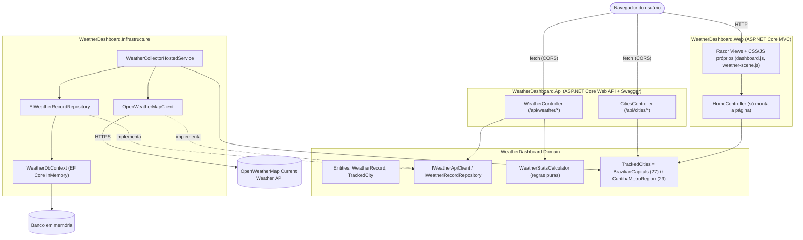
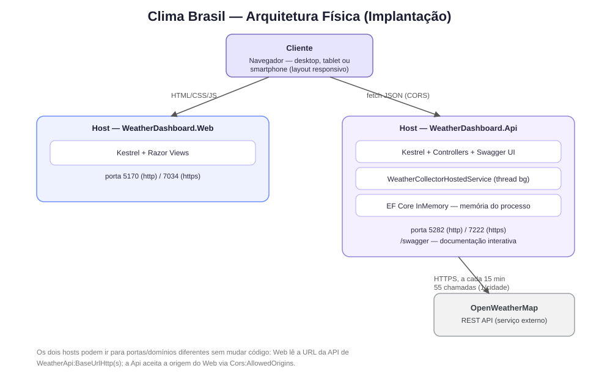
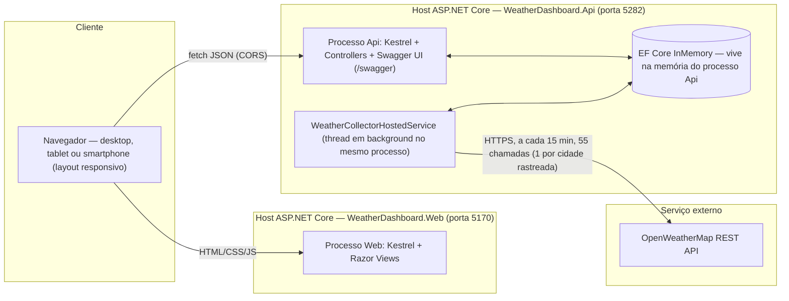
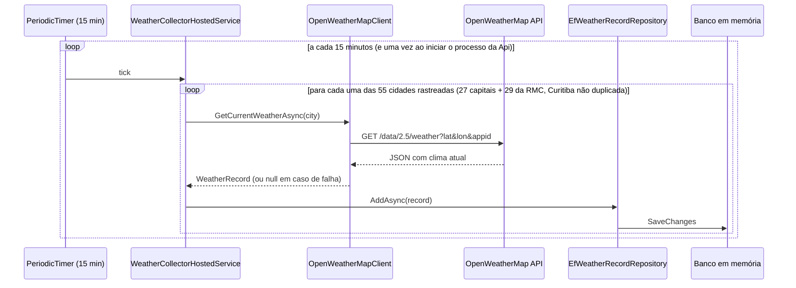

# Arquitetura

## Visão geral

O sistema é composto por **dois executáveis .NET independentes** — uma API
e um site — mais dois projetos de biblioteca compartilhados e um projeto de
testes:

| Projeto | Tipo | Responsabilidade | Depende de |
|---|---|---|---|
| `WeatherDashboard.Domain` | Biblioteca | Entidades, interfaces (contratos), regras de negócio puras (cálculo de estatísticas), catálogos de cidades (capitais + Região Metropolitana de Curitiba) | nada (sem dependências externas) |
| `WeatherDashboard.Infrastructure` | Biblioteca | EF Core (InMemory), cliente HTTP da OpenWeatherMap, serviço em background que coleta dados a cada 15 min | `Domain` |
| `WeatherDashboard.Api` | **Executável** | Web API + Swagger. Dona dos dados: roda o coletor em background e expõe o histórico por HTTP | `Infrastructure`, `Domain` |
| `WeatherDashboard.Web` | **Executável** | Site MVC. Renderiza a página e os seletores de cidade; o histórico em si é buscado pelo navegador direto na API | `Domain` |
| `WeatherDashboard.Tests` | Testes | Testes unitários (xUnit + Moq) | todos os anteriores |

A `Api` e o `Web` são dois processos separados, cada um com sua própria
porta, `Program.cs` e `appsettings.json` — **os dois precisam estar rodando**
para o dashboard funcionar (veja a wiki de instalação). O `Web` não referencia
`Infrastructure`: não conhece EF Core nem faz nenhuma chamada de rede para a
OpenWeatherMap, só usa `Domain` para montar os seletores de cidade (dados
estáticos, sem custo de manter a referência). O `Domain` não conhece EF Core,
HTTP ou ASP.NET — expõe apenas interfaces (`IWeatherRecordRepository`,
`IWeatherApiClient`) que a `Infrastructure` implementa. Isso deixa a regra de
negócio (`WeatherStatsCalculator`) trivialmente testável sem banco de dados
ou rede, e permite trocar o provedor de dados (ex.: banco relacional em vez
de InMemory) sem tocar em `Domain`, `Api` ou `Web`.

## Diagrama lógico (componentes)

Versão Mermaid (equivalente, texto-fonte editável)

O navegador chama a API **diretamente** (não passa pelo site) para buscar o
histórico e os destaques — por isso a API tem CORS habilitado explicitamente
para a origem do site (`Cors:AllowedOrigins` em `appsettings.json`).

## Diagrama físico (implantação)

Versão Mermaid (equivalente, texto-fonte editável)

Os dois processos podem ser implantados em hosts/portas diferentes sem
mudança de código — a URL da API é configurável no `Web` via
`WeatherApi:BaseUrl` (`appsettings.json`), e as origens permitidas na API via
`Cors:AllowedOrigins`.

**Observação sobre o banco em memória:** como recomendado no enunciado, o
provedor padrão é `EF Core InMemory` — os dados vivem no processo da `Api` e
são perdidos a cada reinício, o que é adequado para desenvolvimento/avaliação.
Como o acesso ao banco passa por `IWeatherRecordRepository`, trocar para um
provedor persistente (SQLite/SQL Server) em produção é uma mudança de uma
linha em [`InfrastructureServiceCollectionExtensions`](../src/WeatherDashboard.Infrastructure/InfrastructureServiceCollectionExtensions.cs) — nenhum outro
código muda.

## Fluxo de coleta periódica

Falhas de rede, chave inválida ou rate limit em uma cidade são logadas e
**não** interrompem o ciclo — as demais cidades continuam sendo coletadas.

## Fluxo de leitura do dashboard

1. `GET /` no site (`HomeController.Index`, `WeatherDashboard.Web`) renderiza
   a página com o seletor de cidades (agrupado em "Região Metropolitana de
   Curitiba" e "Capitais") e os filtros de data (padrão: últimos 7 dias). A
   cidade padrão é Curitiba. Nenhum dado climático é buscado nesta etapa.
2. O JavaScript (`wwwroot/js/dashboard.js`) faz `fetch` **direto na API**,
   em `GET {WeatherApi:BaseUrl}/api/weather/data?city=...&start=...&end=...`
   e `GET {WeatherApi:BaseUrl}/api/weather/highlights`.
3. `WeatherController.Data` (`WeatherDashboard.Api`) busca os registros do
   período no repositório e usa `WeatherStatsCalculator` (Domain) para
   agregar por dia — sem lógica de agregação no controller ou no banco.
4. A resposta JSON alimenta dois gráficos (Chart.js), os cartões de
   estatística do dia atual e a cena de fundo animada (`weather-scene.js`),
   que muda conforme o ícone da condição climática atual.
5. O front-end reconsulta automaticamente a cada 5 minutos, então uma nova
   coleta do background service (na `Api`) aparece no dashboard sem precisar
   recarregar a página.

## Cena de fundo animada

`wwwroot/js/weather-scene.js` mapeia o código de ícone da OpenWeatherMap
(ex.: `"10d"`, `"01n"`) para uma de sete cenas, construídas em DOM/CSS puro
(sem canvas nem bibliotecas): **sol**, **sol com nuvens**, **nublado**,
**chuva**, **tempestade** (chuva mais densa + relâmpago + fundo mais escuro),
**noite limpa** (céu estrelado) e **noite nublada**. A cena só é reconstruída
quando a condição muda (não a cada refresh de 5 min), para não gerar
trabalho de DOM desnecessário. Respeita `prefers-reduced-motion`.

## Principais decisões e suposições

- **MVC, não Razor Pages/Blazor**: solicitado explicitamente.
- **API separada com Swagger**: a coleta de dados e a exposição do histórico
  vivem em `WeatherDashboard.Api`, um executável próprio com Swagger UI em
  `/swagger`; o site (`WeatherDashboard.Web`) é só a interface, sem acesso a
  banco de dados. O navegador chama a API diretamente (CORS), não o site —
  evita duplicar a camada de rede e deixa a API reutilizável por qualquer
  outro cliente (mobile, outro front-end, scripts).
- **Região Metropolitana de Curitiba como catálogo principal**: o requisito
  do enunciado pede a seleção a partir das capitais estaduais, mas o uso real
  do dashboard prioriza os municípios da RMC — por isso a tira de destaque e a
  cidade padrão (Curitiba) mostram a RMC ao abrir a aplicação, com um botão
  "Ver capitais" para alternar para o conjunto de capitais estaduais, mantendo
  o requisito original disponível. O seletor de cidade sempre lista os dois
  catálogos (`TrackedCities`, a união de `CuritibaMetroRegion` e
  `BrazilianCapitals`), então qualquer uma das 55 cidades pode ser escolhida
  independentemente de qual conjunto está em destaque.
- **Destaque só das cidades que fazem fronteira com Curitiba** (9 de 29
  municípios da RMC): Colombo, Pinhais, São José dos Pinhais, Araucária,
  Campo Largo, Fazenda Rio Grande, Quatro Barras e Piraquara, além da própria
  Curitiba — os demais 20 municípios da região continuam selecionáveis pelo
  dropdown, só não aparecem na tira de atalhos.
- **Coleta para todas as 55 cidades rastreadas a cada ciclo**, não apenas a
  selecionada: o requisito pede atualização a cada 15 min e permitir trocar de
  cidade livremente: pré-coletar todas evita telas vazias ao trocar o filtro e
  fica dentro do limite gratuito da OpenWeatherMap (60 chamadas/min).
- **Agregação diária nos gráficos**: o período pode cobrir vários dias; cada
  ponto do gráfico é a agregação (mín/média/máx) das leituras daquele dia. As
  estatísticas "do dia atual" nos cartões usam sempre a data corrente,
  independentemente do filtro escolhido, como pedido no enunciado.
  ("temperatura máxima, mínima e média no período" +
  "lista de dados estatísticos do dia atual").
- **CSS e HTML escritos à mão** (sem Bootstrap/Tailwind ou templates
  prontos), conforme recomendado. É usada apenas a fonte Inter (Google Fonts)
  e os ícones Phosphor (fonte de ícones), além do Chart.js para os gráficos —
  bibliotecas pontuais, não um template de página pronto.
- **Falha silenciosa e resiliente na coleta**: sem chave de API configurada,
  a `Api` sobe normalmente e mostra um estado vazio no dashboard, em vez
  de falhar — importante para rodar o projeto localmente antes de configurar
  a chave.
